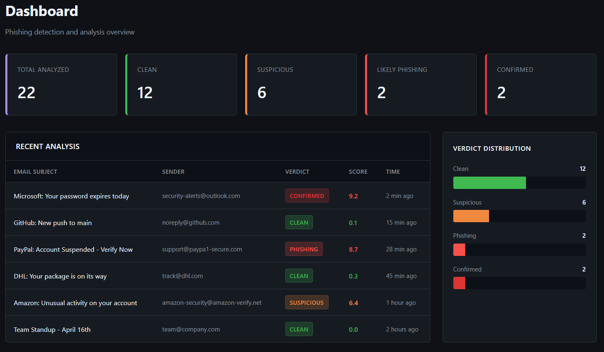

# Automated Phishing Detection Pipeline

Analyzes phishing emails through a 7-stage async pipeline with concurrent threat intelligence lookups, MITRE ATT&CK mapping across 12 sub-techniques, Sigma rule export, and STIX 2.1 IOC generation. Designed as analyst tooling, not autonomous detection.

**Current eval (live APIs):** 0.90 recall, 1.00 precision, 0.95 F1 (permissive scoring) on the committed 22-sample project corpus. TP=9, FP=0, TN=12, FN=1. Strict recall is 0.00 because phishing detections cluster in the SUSPICIOUS band (0.30-0.60), below the LIKELY_PHISHING threshold. A remote public-corpus smoke run on commit `c459237` used Nazario phishing plus Enron and SpamAssassin ham: 15 samples, permissive precision 0.714, recall 1.000, F1 0.833, accuracy 0.867; strict F1 0.000. Treat that as a smoke baseline, not a product metric. Per-sample committed data lives in [`eval_runs/`](eval_runs/); generated public corpora stay under ignored `data/eval_corpus*`.

**What makes this project different** is not the detection numbers. It is the engineering arc documented in [`HISTORY.md`](HISTORY.md): fourteen disciplined audit cycles, seven stacked discipline gaps that took four audits to surface, a mechanical pre-cycle gate that enforces reading outcomes before narrative, and honest eval data that includes the cycles where the numbers were bad. The full story -- including how a 0.20 recall baseline was misdiagnosed for two cycles before the real cause was found -- is in the [writeup](docs/WRITEUP.md).

Static demo screenshot generated from `docs/demo_screenshot.html` with realistic sample data:



## Agent-native Payment Scam Firewall Demo

This repo now includes a sample-only product slice for invoice and payment
scams. It exposes `analyze_payment_email` as a CLI and MCP tool so an AI
accounts-payable agent can get a structured payment decision before money
moves:

```text
SAFE | VERIFY | DO_NOT_PAY + evidence + next action
```

Fastest local proof:

```powershell
.\.venv\Scripts\python.exe scripts\agent_payment_demo.py
```

The committed samples show three outcomes:

| Sample | Decision | Action |
|---|---:|---|
| `safe_invoice.eml` | `SAFE` | Continue normal payment approval. |
| `verify_supplier_portal.eml` | `VERIFY` | Hold payment for out-of-band verification. |
| `do_not_pay_bank_redirect.eml` | `DO_NOT_PAY` | Block payment release until verification is complete. |

The Gemini CLI demo proves the agent boundary: Gemini calls the local
`payment-scam-firewall` MCP server, receives the tool result, and writes an AP
team note grounded in that evidence. See
[`docs/gemini-mcp-demo-kit.md`](docs/gemini-mcp-demo-kit.md) for the recording
script and [`docs/agent-payment-three-case-transcript.md`](docs/agent-payment-three-case-transcript.md)
for the three-case transcript.

Run the product shell locally:

```powershell
.\.venv\Scripts\python.exe main.py serve --host 127.0.0.1 --port 8766
```

Then open:

```text
http://127.0.0.1:8766/product
```

Safety boundary: the public demo uses committed samples only. It does not
connect visitor mailboxes, call paid APIs, release payments, expose full email
bodies, or write feedback labels.

## Project Arc

This started as a working phishing detection pipeline with a foundation problem: an external audit identified 21 findings including 7 P0 security and correctness issues. The codebase was ambitious but the perimeter was unauthenticated, the SSRF surface was a textbook Capital-One-class primitive, the LinkedIn FP that survived four prior fix attempts was rooted in a missing architectural primitive (cross-analyzer context sharing), and the BEC detection claim was load-bearing on real samples accidentally containing URLs.

Over **8 cycles** following a strict TEST → AUDIT → UPDATE → COMMIT → FINAL TEST → PUSH → AUDIT loop, every P0 was closed, 9 of 11 P1 items were resolved, and non-obvious design decisions were captured in **ADRs written before any code**. The test suite grew from 676 to 899 with zero regressions across the arc. CI was added and verified to bite via a deliberately-red sanity branch. Two architectural changes (cross-analyzer calibration in cycle 6, persistent email_id lookup in cycle 8) shipped with full failure-mode documentation and locking tests named after the bugs they prevent.

The full cycle history with commit hashes, audit-item closures per cycle, and discovered-and-deferred findings is in [`HISTORY.md`](HISTORY.md). Read that file first if you want the 90-second skim.

## Where to read next

| Reader | Start here |
|---|---|
| Product reviewer / demo | [`docs/gemini-mcp-demo-kit.md`](docs/gemini-mcp-demo-kit.md) -> [`docs/agent-payment-three-case-transcript.md`](docs/agent-payment-three-case-transcript.md) |
| Hiring manager / 90-second skim | [`HISTORY.md`](HISTORY.md) — arc summary + per-cycle table |
| Detection engineer | [`docs/MITRE_ATTACK_MAPPING.md`](docs/MITRE_ATTACK_MAPPING.md) → [`sigma_rules/`](sigma_rules/) |
| Security reviewer | [`THREAT_MODEL.md`](THREAT_MODEL.md) → [`SECURITY.md`](SECURITY.md) |
| Architecture-curious | [`docs/adr/0001-cross-analyzer-context-passing.md`](docs/adr/0001-cross-analyzer-context-passing.md) → [`docs/adr/0002-persistent-email-id-lookup-for-feedback.md`](docs/adr/0002-persistent-email-id-lookup-for-feedback.md) |
| Wants the ground truth on what's broken | [`lessons-learned.md`](lessons-learned.md) |

## Architecture

```
Email Ingestion → Feature Extraction → Concurrent Analysis → Decision Engine → Reporting
     │                   │                    │                    │              │
  IMAP poll         EML parsing         8 analyzers           Weighted        JSON/HTML
  Manual upload     Header analysis     (async parallel)      scoring         STIX 2.1
  .eml/.msg files   URL extraction      API clients           Overrides       Dashboard
                    QR decoding         NLP intent            Calibration     Sigma rules
                    Attachments         Brand matching        Thresholds
```

The decision engine has two passes: pass 1 runs analyzers concurrently, pass 2 applies cross-analyzer calibration rules (ADR 0001) that can lower a verdict but never raise it and never modify the underlying weighted score. The persistent email_id lookup (ADR 0002) lets the feedback endpoint resolve sender-for-blocklist across server restarts.

## Eval results

Per-sample eval data lives in [`eval_runs/`](eval_runs/) — one JSONL per run plus a `.summary.json` aggregate. Each row records the predicted verdict, the per-analyzer scores, the calibration outcome, the LLM model ID actually used, and the commit SHA the eval was run against. **The directory is the link, not any specific run** — numbers go stale and individual filenames decay.

To produce a new run against the built-in 22-sample corpus:

```bash
python scripts/run_eval.py
```

Default corpus is `tests/real_world_samples/` (the project's own 22-sample labeled set). To prepare a larger ignored local corpus from downloaded public data:

```bash
bash scripts/download_corpora.sh
python scripts/eval_prepare_corpus.py --output data/eval_corpus --phishing 200 --enron-ham 200 --spamassassin-ham 100 --clean-output
python scripts/run_eval.py --corpus data/eval_corpus --labels data/eval_corpus/labels.json
python scripts/phishing_train.py --corpus data/eval_corpus
```

`scripts/eval_prepare_corpus.py` writes `.eml` samples, `labels.json` for the evaluator, `labels.csv` for ML workflows, `manifest.jsonl` for provenance, and `summary.json` for reproducibility. `scripts/phishing_train.py` trains a TF-IDF + logistic regression baseline from that prepared public corpus and writes ignored artifacts under `models/phishing_classifier/`. The generated corpus and model artifacts stay out of git.

To inspect failures after an eval run:

```bash
python scripts/eval_inspect_failures.py --results eval_runs/RUN_ID.jsonl --manifest data/eval_corpus/manifest.jsonl --projection permissive --output data/eval_corpus/failure_report_permissive
python scripts/eval_inspect_failures.py --results eval_runs/RUN_ID.jsonl --manifest data/eval_corpus/manifest.jsonl --projection strict --output data/eval_corpus/failure_report_strict
```

The harness produces per-sample TP/FP/TN/FN flags under two binary projections (permissive: SUSPICIOUS+ counts as PHISHING; strict: LIKELY_PHISHING+). Aggregate precision/recall/F1 and accuracy are computed from the flags.

> **The harness is the deliverable, the numbers are data.** Detection-quality improvements should be tracked by diffing the per-sample JSONL between commits, not by chasing aggregate metrics in isolation. See [`HISTORY.md`](HISTORY.md) cycle 10 for the rationale.

## Detection Coverage

The pipeline covers ~12 sub-techniques across **TA0001 Initial Access**, **TA0042 Resource Development**, **TA0005 Defense Evasion**, and **TA0008 Lateral Movement**. Full mapping with per-analyzer rationale and known gaps lives in [`docs/MITRE_ATTACK_MAPPING.md`](docs/MITRE_ATTACK_MAPPING.md).

| Tactic                   | Techniques covered                                                                  |
| ------------------------ | ----------------------------------------------------------------------------------- |
| Initial Access           | T1566.001, T1566.002, T1566.003, T1534, T1078 (anomaly only)                         |
| Resource Development     | T1583.001, T1584.001, T1585.002                                                      |
| Defense Evasion          | T1656, T1036.005, T1027.006 (HTML smuggling)                                         |
| User Execution           | T1204.001, T1204.002                                                                 |

The mapping doc also includes an explicit **uncovered techniques** table — what an honest reader would ask about and what the pipeline does not pretend to detect (T1078 full, T1189, T1497, etc.).

### 5-Stage Pipeline

1. **Ingestion** — IMAP polling with UID tracking, manual `.eml`/`.msg` upload, FastAPI upload endpoint
2. **Extraction** — MIME parsing, header analysis (SPF/DKIM/DMARC), URL extraction, QR code decoding, attachment classification via magic bytes
3. **Analysis** — 8 concurrent analyzers: header analysis, URL reputation, domain intelligence, URL detonation, brand impersonation, attachment sandbox, NLP intent classification, payment fraud
4. **Decision** — Weighted confidence scoring with override rules (known malware, BEC intent, confirmed feeds), confidence capping, verdict thresholds
5. **Feedback** — Analyst verdict submission via REST API, logistic regression weight retraining, scheduled retraining loop

## Payment Fraud Firewall

The pipeline now includes a payment-specific fraud layer for invoice scams, supplier impersonation, and business email compromise. It keeps the detection engineering core, but gives SMEs a direct payment-release decision.

The `payment_fraud` analyzer turns email analysis into a business decision:

| Decision | Meaning |
|----------|---------|
| `SAFE` | No material payment scam indicators were found. |
| `VERIFY` | Payment should not proceed until the supplier or executive is independently verified. |
| `DO_NOT_PAY` | Payment release should be blocked until verification is completed. |

Detected payment signals include changed bank details, payment-themed portal/action links, urgent payment pressure, approval bypass language, CEO/CFO transfer requests, reply-to mismatch, email authentication failure, free-email supplier requests, risky invoice attachments, and masked extraction of BSBs, account numbers, IBANs, SWIFT/BIC codes, PayIDs, ABNs, and amounts.

See [`docs/payment-fraud-firewall.md`](docs/payment-fraud-firewall.md) for the product workflow and SME positioning.
See [`docs/agent-payment-tool.md`](docs/agent-payment-tool.md) for the first
agent-native tool contract, CLI, MCP stdio server, committed sample emails,
connection snippets, MCPB desktop-extension bundle, narrative demo scripts,
product shell, and sample-only demo page.
See [`docs/gemini-mcp-demo-kit.md`](docs/gemini-mcp-demo-kit.md) for the
Gemini CLI proof package and recording script.

To start a local payment-scam dataset:

```bash
python scripts/payment_dataset.py init --dataset data/payment_scam_dataset
python scripts/payment_dataset.py seed-synthetic --dataset data/payment_scam_dataset --scam-count 50 --legit-count 50 --safe-count 50 --seed 1337 --clean
python scripts/payment_dataset.py seed-public-advisory --dataset data/payment_scam_dataset --holdout-do-not-pay-count 3 --holdout-verify-count 3
python scripts/payment_dataset.py seed-public-corpus --dataset data/payment_scam_dataset --corpora-dir data/corpora --do-not-pay-count 0 --verify-count 20 --replace-existing
python scripts/payment_dataset.py redact --source path/to/raw-payment-email.eml --output data/payment_scam_dataset/incoming/redacted/vendor-update.eml
python scripts/payment_dataset.py audit-pii --sample data/payment_scam_dataset/incoming/redacted/vendor-update.eml
python scripts/payment_dataset.py add --dataset data/payment_scam_dataset --source path/to/sample.eml --label PAYMENT_SCAM --payment-decision DO_NOT_PAY --scenario bank_detail_change --source-type redacted --split train --verified-by meidie --contains-real-pii no
python scripts/payment_dataset.py validate --dataset data/payment_scam_dataset
python scripts/payment_dataset.py export-eval-labels --dataset data/payment_scam_dataset
python scripts/payment_dataset.py export-ml-jsonl --dataset data/payment_scam_dataset
python scripts/payment_dataset.py readiness --dataset data/payment_scam_dataset
python scripts/payment_eval.py --dataset data/payment_scam_dataset
python scripts/payment_eval.py --dataset data/payment_scam_dataset --split holdout --output-prefix data/payment_scam_dataset/reports/payment_holdout_eval
python scripts/payment_train.py --dataset data/payment_scam_dataset
python scripts/payment_demo.py --dataset data/payment_scam_dataset
```

The payment dataset records both the generic label (`PAYMENT_SCAM`, `LEGITIMATE_PAYMENT`, `NON_PAYMENT`) and the expected business decision (`SAFE`, `VERIFY`, `DO_NOT_PAY`). The synthetic seed set is for repeatable development only; replace or supplement it with redacted real examples before claiming product metrics.
`seed-public-advisory` adds non-private `VERIFY` and `DO_NOT_PAY` examples based on public BEC/payment-redirection warning patterns from Scamwatch, cyber.gov.au, the FBI, and public BEC writeups. These are better than synthetic-only plumbing checks, but real redacted inbox/client samples are still the strongest evidence. The optional holdout flags keep public-derived rows out of training so you can inspect a separate eval slice.
`seed-public-corpus` mines downloaded Nazario phishing and SpamAssassin spam corpora for invoice/payment/wire/bank/account language, keeps only obvious payment-risk cases, redacts and neutralizes domains, URLs, and payment identifiers, then labels the result as PII-free public samples. Its default is conservative: use raw public phishing/spam mostly for `VERIFY` payment-link and payment-notification language, while the advisory seed remains the better reproducible source for clean `DO_NOT_PAY` BEC/payment-redirection patterns.
The redaction tool pseudonymizes email and URL domains, normalizes obvious payment identifiers, removes non-text attachments, and audits the result using non-sensitive fingerprints. Manually review the redacted `.eml` before labeling because names and business context can still need human cleanup.
`scripts/payment_eval.py` writes JSON, CSV, and Markdown reports that compare expected vs predicted `SAFE`, `VERIFY`, and `DO_NOT_PAY` decisions, including accuracy by source type and split.
`scripts/payment_train.py` trains and tests a TF-IDF + logistic regression baseline from the ML JSONL export, writing ignored model artifacts under `models/payment_classifier/`. Holdout rows are excluded from training and reported separately. When `models/payment_classifier/payment_decision_model.joblib` exists, the payment analyzer reports an `ml_decision` sidecar with the model prediction, confidence, class probabilities, and whether it disagrees with the rules decision. The rules decision remains authoritative until the dataset has real redacted coverage.
`scripts/payment_dataset.py readiness` counts source types, labels, decisions, and splits, and explicitly warns when non-synthetic coverage is missing for a payment decision.
`scripts/payment_demo.py` prints a compact expected-vs-predicted demo across `SAFE`, `VERIFY`, and `DO_NOT_PAY`, preferring PII-free redacted/public samples over synthetic rows.

Current local ignored dataset snapshot (2026-04-30): 259 rows, including 150 synthetic, 46 public, and 63 redacted samples. Payment decisions are 113 `SAFE`, 83 `VERIFY`, and 63 `DO_NOT_PAY`. The latest local PII audit found 0 findings, the rules eval matched 259/259 expected decisions, and the TF-IDF payment sidecar reached 1.000 test accuracy and 1.000 holdout accuracy. Treat this as local reproducibility evidence, not an external product metric, because the redacted dataset and trained model artifacts are intentionally not committed.

## Quick Start

### Prerequisites

Python 3.11+, and on Linux/macOS you need `libzbar0` for QR code decoding:

```bash
# Debian/Ubuntu
sudo apt-get install libzbar0

# macOS
brew install zbar
```

### Local setup

```bash
# 1. Clone and install
git clone https://github.com/meidielo/Automated-Phishing-Detection.git
cd Automated-Phishing-Detection
pip install -r requirements.txt

# 2. Configure
cp .env.example .env
# Edit .env with your API keys. See .env.example for signup links
# and which keys are optional. The pipeline degrades gracefully:
# analyzers without keys are excluded from scoring.

# 3. Run the eval harness against the included 22-sample corpus
python scripts/run_eval.py

# 4. Analyze a single email
python main.py --analyze tests/real_world_samples/sample_01_microsoft_credential_harvest.eml

# 5. Start the server (dashboard + feedback API)
python main.py --serve
```

### Docker

```bash
cp .env.example .env
# Edit .env with your API keys
docker-compose up -d
# Dashboard at http://localhost:8000
```

### Verify it works

After starting the server (step 5 or Docker), check the health endpoint:

```bash
python -c "import urllib.request; print(urllib.request.urlopen('http://localhost:8000/api/health').read().decode())"
```

## Configuration

Configuration loads from two sources (env vars override YAML):

| Source | File | Purpose |
|--------|------|---------|
| YAML | `config.yaml` | Non-secret defaults (weights, thresholds, timeouts) |
| Environment | `.env` | Secrets (API keys, IMAP credentials) |

See `config.yaml` for all available options with inline documentation.

### Public demo mode

Set `PUBLIC_DEMO_MODE=true` to expose `/demo` and `/agent-demo` as sample-only public previews. When public demo mode is off, those HTML pages redirect back to `/product` instead of showing raw API errors. This is intentionally not an auth bypass for the real app: `/analyze`, `/dashboard`, `/monitor`, `/accounts`, live upload analysis, mailbox monitoring, feedback learning, and account management still require the analyst token. The public root `/` redirects to `/product` so visitors do not land on an admin login.

The demo page uses fixed sample content and `/api/demo/status` advertises the locked capabilities. Keep `ANALYST_API_TOKEN` configured before exposing the deployment publicly. A real multi-user mailbox version still needs per-user OAuth or IMAP credentials and encrypted per-user tokens so each person only sees their own mailbox.

`/api/demo/plans` exposes the public plan and feature-lock catalog used by the demo. The same plan slugs now back the SaaS account foundation and are intended to back Stripe Billing webhook state later. See [`docs/saas-architecture.md`](docs/saas-architecture.md) for the user/org database schema, tenant isolation rules, and subscription rollout order.

### SaaS account mode

`/app` serves a normal user-login shell separate from the analyst dashboard. It uses signed user sessions, CSRF protection, and `data/saas.db` for `users`, `organizations`, `memberships`, `subscriptions`, `scan_jobs`, `scan_results`, `usage_events`, `feature_locks`, and `audit_logs`.

Public signup is off by default:

```bash
SAAS_SESSION_SECRET=change-me-to-a-long-random-secret
SAAS_DB_PATH=data/saas.db
SAAS_PUBLIC_SIGNUP_ENABLED=false
PASSWORD_RESET_TOKEN_TTL_MINUTES=30
```

Password reset is supported through `/api/saas/auth/password-reset/request` and `/api/saas/auth/password-reset/confirm`. Reset tokens are stored hashed, expire after `PASSWORD_RESET_TOKEN_TTL_MINUTES`, and are one-time use. Requests are rate-limited per client/email pair to reduce reset-link spam. Configure SMTP to send reset links through Zoho Mail or another transactional SMTP provider:

```bash
SMTP_HOST=smtp.zoho.com
SMTP_PORT=587
SMTP_USERNAME=alerts@example.com
SMTP_PASSWORD=zoho-app-specific-password
SMTP_FROM_EMAIL=alerts@example.com
SMTP_FROM_NAME=PhishAnalyze
SMTP_USE_SSL=false
SMTP_STARTTLS=true
```

Zoho Mail supports `smtp.zoho.com` with SSL on port `465` or TLS/STARTTLS on port `587`. If Zoho two-factor authentication is enabled, use a Zoho application-specific password rather than the mailbox login password. If SMTP is not configured, the API returns a generic success response without sending mail so account existence is not leaked.

When signup is enabled, free accounts get 5 manual scans/month. `/api/saas/analyze/upload` stores user scans in the tenant-scoped SaaS DB instead of the shared analyst `data/results.jsonl` log. Expensive analyzers check plan entitlements before loading clients; locked checks return structured `feature_locked` metadata so the UI can show the required tier instead of burning paid API quota.

Stripe Billing is wired through hosted Checkout and Customer Portal. Configure `PUBLIC_BASE_URL`, `STRIPE_SECRET_KEY`, `STRIPE_WEBHOOK_SECRET`, and the monthly Stripe Price IDs in `STRIPE_PRICE_STARTER` / `STRIPE_PRICE_PRO` / `STRIPE_PRICE_BUSINESS`. Yearly checkout uses `STRIPE_PRICE_STARTER_YEARLY` / `STRIPE_PRICE_PRO_YEARLY` / `STRIPE_PRICE_BUSINESS_YEARLY`. The app shows lower yearly-per-month pricing, sends the selected billing interval to Checkout, and mirrors `checkout.session.completed` plus `customer.subscription.*` events into `subscriptions`. If Stripe env is missing or the runtime key is rejected by Stripe, checkout reports a safe billing-unavailable response instead of pretending billing is live.

## API Keys Required

| Service | Environment Variable | Purpose | Free Tier |
|---------|---------------------|---------|-----------|
| VirusTotal | `VIRUSTOTAL_API_KEY` | URL/file reputation | 500 req/day |
| urlscan.io | `URLSCAN_API_KEY` | URL scanning | 5,000 req/day |
| AbuseIPDB | `ABUSEIPDB_API_KEY` | IP reputation | 1,000 req/day |
| Google Safe Browsing | `GOOGLE_SAFE_BROWSING_API_KEY` | URL threat matching | 10,000 req/day |
| Hybrid Analysis | `HYBRID_ANALYSIS_API_KEY` | File sandbox detonation | Limited |

Optional: Anthropic/OpenAI key for NLP intent classification, ANY.RUN/Joe Sandbox keys for additional sandbox providers.

## Project Structure

```
src/
├── config.py                    # Configuration (env + YAML)
├── models.py                    # Data models and enums
├── ingestion/
│   ├── imap_fetcher.py          # IMAP polling with UID tracking
│   └── manual_upload.py         # File/directory upload handler
├── extractors/
│   ├── eml_parser.py            # MIME email parsing
│   ├── header_analyzer.py       # SPF/DKIM/DMARC validation
│   ├── url_extractor.py         # URL extraction and defanging
│   ├── qr_decoder.py            # QR code decoding from images/PDFs
│   ├── metadata_extractor.py    # Sender/reply chain metadata
│   └── attachment_handler.py    # Magic byte classification, macros
├── analyzers/
│   ├── url_reputation.py        # Multi-service URL checking
│   ├── domain_intel.py          # WHOIS age, DNS, phishing feeds
│   ├── url_detonator.py         # Headless browser detonation
│   ├── brand_impersonation.py   # Visual similarity (pHash/SSIM)
│   ├── nlp_intent.py            # LLM + sklearn intent classification
│   ├── sender_profiling.py      # Behavioral baseline tracking
│   ├── attachment_sandbox.py    # File sandbox submission
│   └── clients/                 # API client layer
│       ├── base_client.py       # Circuit breaker, cache, rate limiting
│       ├── virustotal.py
│       ├── urlscan.py
│       ├── abuseipdb.py
│       ├── google_safebrowsing.py
│       ├── whois_client.py
│       └── sandbox_client.py
├── scoring/
│   ├── decision_engine.py       # Weighted scoring + overrides
│   ├── confidence.py            # Multi-source confidence aggregation
│   └── thresholds.py            # Verdict range management
├── feedback/
│   ├── feedback_api.py          # FastAPI analyst endpoints
│   ├── database.py              # SQLAlchemy ORM
│   ├── retrainer.py             # Logistic regression weight tuning
│   └── scheduler.py             # Background retraining
├── reporting/
│   ├── report_generator.py      # JSON + HTML reports
│   ├── ioc_exporter.py          # STIX 2.1 bundle export
│   └── dashboard.py             # Web dashboard
├── orchestrator/
│   └── pipeline.py              # Main async orchestrator
└── utils/
    ├── cyberchef_helpers.py     # Encoding/decoding utilities
    ├── screenshot.py            # URL detonation captures
    └── validators.py            # Input validation
```

## Detection Content Exports

The pipeline emits two complementary detection artifacts in addition to JSON/HTML reports:

| Format    | Purpose                                                          | Generator                              |
| --------- | ---------------------------------------------------------------- | -------------------------------------- |
| STIX 2.1  | Per-incident IOC bundle for sharing with TI platforms (MISP, OpenCTI, TAXII) | `src/reporting/ioc_exporter.py`        |
| Sigma     | Per-campaign detection rule for SIEM consumption, plus a static rule library covering broader behavioral patterns | `src/reporting/sigma_exporter.py` + `sigma_rules/` |

```bash
# Single email → JSON report
python main.py analyze tests/sample_emails/suspicious.eml --format json

# Single email → STIX 2.1 bundle of detected IOCs
python main.py analyze tests/sample_emails/suspicious.eml --format stix

# Single email → Sigma rule scoped to this campaign's observables
python main.py analyze tests/sample_emails/suspicious.eml --format sigma

# All four (json + html + stix + sigma) written side by side
python main.py analyze tests/sample_emails/suspicious.eml --format all
```

The static Sigma rule library in [`sigma_rules/`](sigma_rules/) ships hand-written rules for visual brand impersonation, quishing, newly registered domains, BEC wire fraud intent, HTML smuggling, and auth-failure-with-attachment patterns. Each rule carries `tags:` referencing the same ATT&CK techniques in the coverage mapping above.

## Testing

The test suite has **1164 tests across 57 test modules** (unit + integration), exercising every analyzer, the decision engine override rules (including the cycle 7 ordering fix that catches pure-text BEC), the cross-analyzer calibration pass (ADR 0001) with explicit cap-ceiling tests, the persistent email_id lookup index (ADR 0002) with cross-restart smoking-gun tests, scoring confidence capping, IOC export, the Sigma exporter, the URL reputation dead-domain confidence downgrade, credential encryption migration, the LLM determinism contract, the generic phishing ML baseline, the payment-fraud dataset/eval/train/demo workflow, the body_html sanitizer with hostile XSS payloads, retention and per-subject erasure across results, alerts, feedback, SaaS scan rows, and sender profiles, dashboard self-hosted chart assets/fallback rendering under a strict dashboard CSP, public demo mode guardrails, SaaS account/session/quota/password-reset/logout gates, Stripe Checkout/webhook subscription mirroring, safe Stripe credential failure responses, link-based SaaS auth navigation, hidden upgrade options, monthly/yearly subscription pricing, plan/feature-lock metadata, static asset cache busting, public-root routing away from admin login, the privacy-safe shared feedback modal, Docker Playwright version pinning, operational backup/health scripts, and the web security middleware (bearer auth, browser session auth with CSRF, user session auth with CSRF, Stripe webhook signatures, SSRF guard, security headers). CI runs the full suite plus a Playwright dashboard chart smoke check on every push and PR against a fresh checkout from the hash-pinned lock file. CI-bites verified by deliberate-red sanity check on a throwaway branch.

```bash
# Run all tests
python -m pytest

# Run with verbose output
python -m pytest -v

# Run a single module
python -m pytest tests/unit/test_decision_engine.py

# Coverage HTML report
python -m pytest --cov=src --cov-report=html
```

| Layer            | Test modules                                                                                          |
| ---------------- | ----------------------------------------------------------------------------------------------------- |
| Extractors       | `test_eml_parser`, `test_header_analyzer`, `test_url_extractor`, `test_qr_decoder`, `test_attachment_handler` |
| Analyzers        | `test_attachment_sandbox`, `test_brand_impersonation`, `test_url_detonation`                          |
| Scoring          | `test_decision_engine`, `test_scoring`                                                                |
| Ingestion        | `test_imap_fetcher`, `test_email_monitor`, `test_blocklist_allowlist`                                 |
| Feedback         | `test_feedback_api`, `test_retrainer`                                                                 |
| Reporting        | `test_report_generator`, `test_ioc_exporter`                                                          |
| Security & utils | `test_security`, `test_web_security`, `test_html_sanitizer`, `test_credentials`, `test_multi_account_monitor`, `test_models`, `test_utils` |
| Detection content | `test_sigma_exporter` (34 tests covering canonical analyzer keys, ATT&CK tag derivation, deterministic UUIDs) |
| URL reputation | `test_url_reputation` (11 tests including the dead-domain confidence downgrade regression) |
| LLM client | `test_anthropic_client` (10 tests locking the determinism contract: temperature=0, top_p=1, model version capture) |
| Integration      | `test_full_pipeline`                                                                                  |

## Known Limitations

1. **Network-dependent features**: URL detonation, API client calls, and IMAP polling require outbound internet access. All API clients degrade gracefully when offline (circuit breaker pattern returns empty results, not errors).

2. **Browser engine required for detonation**: URL detonation and screenshot capture require either Playwright or Selenium with headless Chromium. Without a browser engine, these analyzers return empty results and the pipeline continues with reduced confidence.

3. **QR code decoding dependencies**: Full QR decoding requires `pyzbar`, `opencv-python`, and system library `libzbar0`. Without these, QR-embedded URLs in images won't be extracted. Install with: `apt-get install libzbar0 && pip install pyzbar opencv-python`.

4. **NLP intent classification**: Best results require an LLM API key (Anthropic Claude or OpenAI). Falls back to a sklearn TF-IDF classifier with reduced accuracy (~70% vs ~92% with LLM).

5. **Brand impersonation detection**: Requires `imagehash` and reference brand logos in `brand_references/`. Without reference images, visual similarity scoring is skipped. The pipeline still detects brand impersonation via domain name analysis.

6. **Sandbox analysis latency**: File sandbox detonation (Hybrid Analysis, ANY.RUN, Joe Sandbox) can take 2-10 minutes per file. The pipeline timeout (default 120s) may need increasing for attachment-heavy emails.

7. **STIX 2.1 export**: Requires the `stix2` library (already pinned in `requirements.txt`). Sigma rule export has no extra dependencies — YAML is hand-emitted.

8. **Rate limiting**: Free-tier API keys have strict rate limits. The circuit breaker and TTL cache help, but high-volume deployments need paid API tiers or self-hosted alternatives.

9. **No GPU acceleration**: NLP intent classification and image similarity run on CPU only. This is adequate for email-volume workloads but not for bulk retroactive analysis of large archives.

10. **Public demo is sample-only**: `PUBLIC_DEMO_MODE=true` opens `/demo`, but it does not connect visitor mailboxes or let public users run paid API-backed analysis. Per-user mailbox access requires a separate multi-user auth and storage design.

11. **Single-node deployment**: The current architecture runs on a single node. For multi-node deployment, you'd need to add a message queue (Redis/RabbitMQ) between ingestion and the pipeline, which the async generator interface is designed to support but doesn't implement out of the box.

## Docker Deployment

```bash
docker-compose up -d
```

The current `docker-compose.yml` runs the dashboard/pipeline in `orchestrator` and URL detonation in a separate `browser-sandbox` service. `PLAYWRIGHT_WS_ENDPOINT=ws://browser-sandbox:3000/` makes the analyzer connect to the isolated Playwright server instead of launching Chromium inside the orchestrator container. The orchestrator image still supports local Playwright launch for non-Docker development.

The image:
- Installs from `requirements.lock` with `pip install --require-hashes` so any dependency tampering fails the build.
- Pins the browser sandbox `npx playwright@... run-server` version to the same Playwright version in `requirements.lock`; a unit test fails if Compose and the Python client drift apart.
- Uses `urllib.request`-based healthchecks (no `curl` package), waits for the browser sandbox to be healthy before starting the app, and gives the app a longer startup window before judging it unhealthy.
- Runs `docker-entrypoint.sh` as root briefly to chown the `/app/data` and `/app/logs` bind mounts to UID 1000, then `gosu`s to the non-root `phishing` user before exec'ing the pipeline. This closes the bind-mount UID-mismatch issue that previously broke `results.jsonl` writes on Linux hosts where the host bind-mount source is root-owned.
- Production compose binds `127.0.0.1:8000:8000` for host-local health probes while keeping the service off public and Tailscale interfaces. Cloudflare Tunnel still reaches `http://orchestrator:8000` on the Docker network.
- `scripts/docker_deploy.sh` pulls, rebuilds with the current git SHA, requires `CLOUDFLARE_TUNNEL_TOKEN` for production tunnel deploys, and waits for a healthy orchestrator plus a running `cloudflared-tunnel`. `scripts/docker_self_heal.sh` is intended for host cron/systemd to restart containers that Docker marks `unhealthy` but does not restart automatically.
- HTML pages append the build/static asset version to `/static/*` URLs so browser and Cloudflare caches do not keep serving stale dashboard or app JavaScript after a deploy. `/api/health` returns the active build SHA for quick deployed-version checks.

## DNS Automation

The project runs behind Cloudflare DNS (migrated from Netlify DNS). A helper script automates adding CNAME records for new Netlify-hosted sites:

```bash
# One-time setup: create a Cloudflare API token with Zone > DNS > Edit permission
cp .env.example .env
# Fill in CF_API_TOKEN (CF_ZONE_ID and CF_DOMAIN are pre-filled)

# Add a new subdomain pointing to a Netlify app
./scripts/cf-dns-add.sh myapp cool-blog-abc123
# Creates: myapp.mdpstudio.com.au → cool-blog-abc123.netlify.app (DNS only)
```

The script checks for existing records before creating, prompts before overwriting, and reminds you to add the custom domain in Netlify's site settings afterward. Requires `curl` and `jq`.

For tunnel-backed services (like phishanalyze), routes are configured in the Cloudflare Zero Trust dashboard under Networks → Connectors → tunnel → Published application routes, not via this script.

## Data retention & privacy

Stored email/result artifacts in `data/results.jsonl`, `data/alerts.jsonl`, `data/feedback.db`, `data/saas.db`, and `data/sender_profiles.db` can contain regulated personal information under the Australian Privacy Act and the EU GDPR. The pipeline ships with a 30-day default retention window and a `purge` CLI subcommand:

```bash
# Show what would be deleted without modifying the file
python main.py purge --dry-run

# Apply the default 30-day retention from config
python main.py purge

# Custom retention window
python main.py purge --older-than 7

# Strict mode: also drop rows with unparseable timestamps
python main.py purge --strict

# Purge every supported runtime artifact
python main.py purge --target all

# Erase one address/email_id from results, alerts, feedback labels, and sender profiles
python main.py purge --target all --by-address person@example.com --dry-run
python main.py purge --target all --by-address person@example.com
```

Run the age-based purge from cron daily. Configure the default retention via `data_retention_days` in `config.yaml` or the `DATA_RETENTION_DAYS` environment variable. Use `--by-address` for per-data-subject erasure requests. See `THREAT_MODEL.md` section 6a for the full privacy threat model.

## Production operations

Operational scripts:

```bash
# Runtime backup, excluding secrets by default
python scripts/backup_runtime_data.py --destination backups --retention-days 14

# Uptime plus mailbox-monitor freshness alert
python scripts/production_health_check.py --base-url https://detect.example.com --token "$ANALYST_API_TOKEN" --require-monitor-running

# Load/error probe against a deployment with mailbox monitoring enabled
python scripts/monitor_load_test.py --base-url https://detect.example.com --token "$ANALYST_API_TOKEN" --duration-seconds 60 --concurrency 8 --require-monitor-running

# Vendored Chart.js integrity check
python scripts/vendor_chartjs.py --check
```

See [`docs/production-operations.md`](docs/production-operations.md) for cron, logrotate, backup, uptime, alerting, and load-test guidance.

## Project documentation

| File                                                       | Purpose                                                                          |
| ---------------------------------------------------------- | -------------------------------------------------------------------------------- |
| [`docs/MITRE_ATTACK_MAPPING.md`](docs/MITRE_ATTACK_MAPPING.md) | Per-analyzer ATT&CK technique coverage with explicit gaps                       |
| [`THREAT_MODEL.md`](THREAT_MODEL.md)                       | STRIDE-per-trust-boundary, adversary archetypes, residual risks, non-goals       |
| [`SECURITY.md`](SECURITY.md)                               | Vulnerability disclosure policy, supported versions, hardening guidance          |
| [`docs/production-operations.md`](docs/production-operations.md) | Production backup, health, retention, alerting, and load-test runbook |
| [`docs/saas-architecture.md`](docs/saas-architecture.md) | User login, tenant database, plan gates, and Stripe Billing rollout |
| [`docs/gemini-mcp-demo-kit.md`](docs/gemini-mcp-demo-kit.md) | Gemini MCP demo prompt, recording flow, and safety rails |
| [`docs/agent-payment-three-case-transcript.md`](docs/agent-payment-three-case-transcript.md) | SAFE, VERIFY, and DO_NOT_PAY transcript for the agent payment tool |
| [`docs/EVALUATION.md`](docs/EVALUATION.md)                 | Evaluation methodology and corpus plan                                            |
| [`docs/adr/0001-cross-analyzer-context-passing.md`](docs/adr/0001-cross-analyzer-context-passing.md) | ADR for the two-pass calibration design |
| [`docs/adr/0002-persistent-email-id-lookup-for-feedback.md`](docs/adr/0002-persistent-email-id-lookup-for-feedback.md) | ADR for the persistent email_id lookup index |
| [`docs/calibration_rules.md`](docs/calibration_rules.md)   | Registry of cross-analyzer calibration rules with FP/FN motivation and tests     |
| [`docs/writeups/nlp-nondeterminism.md`](docs/writeups/nlp-nondeterminism.md) | Draft writeup: why temperature=1 silently destroyed test metrics      |
| [`docs/writeups/calibration-rule-patterns.md`](docs/writeups/calibration-rule-patterns.md) | Draft writeup: dampen-vs-corroborate as a pattern choice  |
| [`HISTORY.md`](HISTORY.md)                                 | 8-cycle arc summary, per-cycle table, what's open, counters                       |
| [`CONTRIBUTING.md`](CONTRIBUTING.md)                       | Project-local conventions: workflow, ADR pattern, regression-test naming         |
| [`ROADMAP.md`](ROADMAP.md)                                 | Planned, in-progress, and explicitly-deferred work                                |
| [`lessons-learned.md`](lessons-learned.md)                 | Honest post-mortem of detection-quality bugs found during the audit cycles       |
| [`sigma_rules/README.md`](sigma_rules/README.md)           | Static Sigma rule library index and logsource adaptation guide                   |

## License

See LICENSE file.
